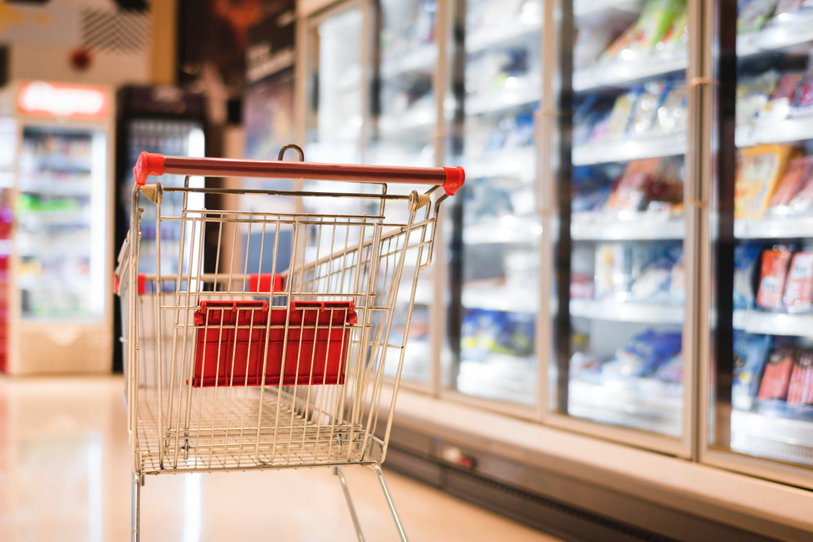
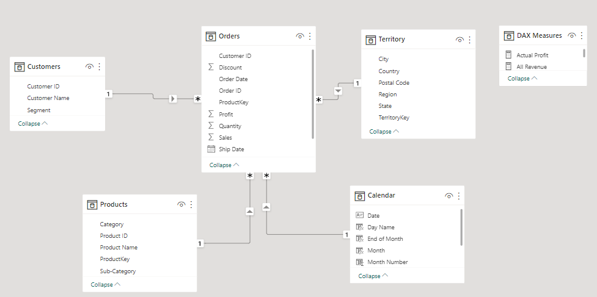
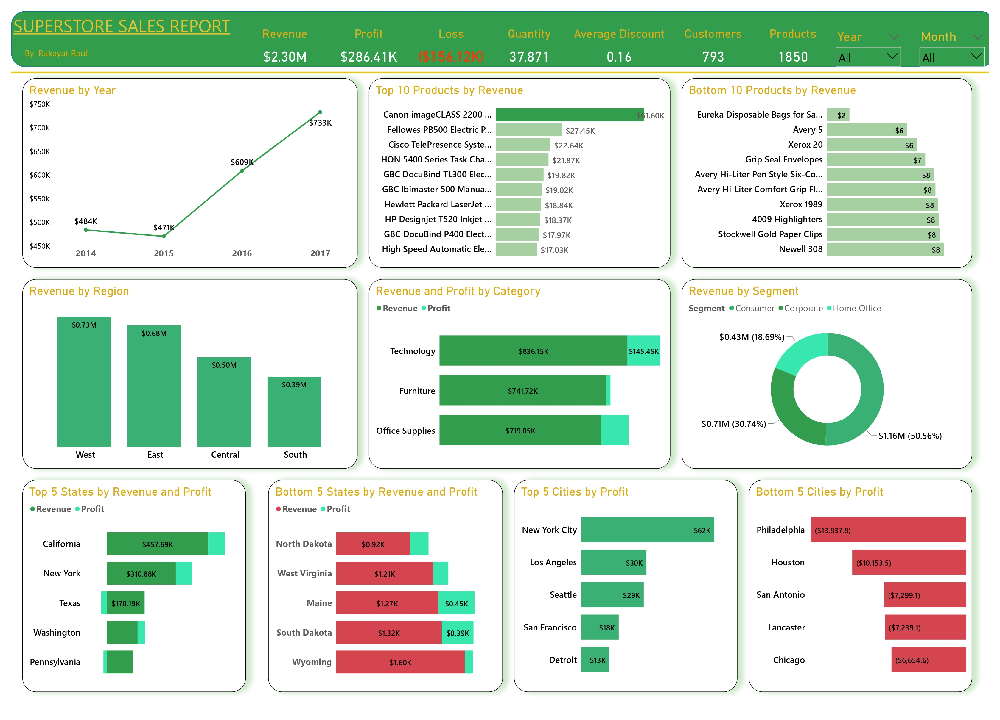
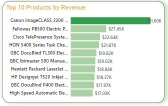
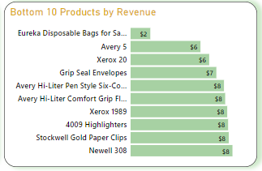
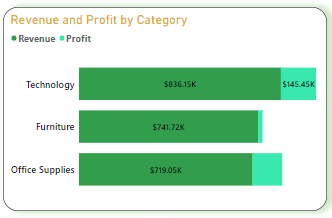
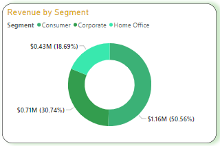
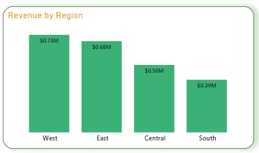
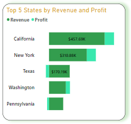

# ANALYSIS-OF-SUPERSTORE-GIANT-SALES

## Introduction
This notebook contains the Analysis of sales of a US-based **Superstore Giant company** that deals in the sales of Furniture, Office Supplies, and Technological products. 
I Analysed their performance in terms of sales and profits generated, products, category, region, and customer segments. This analysis is important in assessing how well the business is doing and to advise on areas that need to be improved. 

## Business Tasks:
With growing demands and cut-throat competition in the market, a Superstore Giant is seeking your knowledge in understanding what works best for them. They would like to understand which products, regions, categories, and customer segments they should target or avoid

## Skills and Concepts demonstrated:
- Excel: Text to Column
- Power BI: Data Modelling, Creating Calculated Table, Calculated Columns/Measures, Advanced DAX, Creating KPIs/Metrics, Filters/Slicers

## Data Source:
The dataset was provided by Octave Incorporations

## Data Transformation:
The dataset was in CSV format and the cleaning was done using Excel. The data contain 9994 records and 21 attributes. The order date and ship date columns were not properly formatted so I used the ‘Text to Column’ to convert them to the proper date using the mm/dd/yyyy date format since the data is from the USA. There were no duplicate rows nor were there any null values. There are 793 unique customers and 1850 unique products sold

## Data Modelling: 
The data was imported into Power BI for proper visualization to be carried out and modeled the data into four different tables: Orders, Products, Customers, and Territories. This was done to optimize the data and reduce redundancy, then primary and foreign keys were used to create relationships between the tables.
I created a new	table for Calendar and another table (DAX Measures) that holds all the new DAX formulas written to create measures to generate more insights from the data

## Data Visualization:
The report consist of one page

You can interact with the report [here](https://app.powerbi.com/view?r=eyJrIjoiYzYxNmU3MzgtZjE4OC00MTUyLTk5NzMtNDk5ZjYyZGQyMTEzIiwidCI6IjExODg4MzNmLTRiMTktNDYzYS04OThmLWM2ODMxNmRjOTQ1NiJ9&pageName=ReportSection)
---
The company generated a total revenue of **$2.30M** and a net profit of **$286,409** leading to a profit margin of **0.12** which is small for a superstore of that size.
To dig deeper into the analysis to know why the profit margin is small,
I created a measure that showed the gross profit generated over the four years which amount to **$442,528** while incurring a loss of **$156,119** during sales over this year. This loss amount to **35%** of the profits.  

### Revenue by Products
       

Canon Image class Advanced copier from the Technology category has the highest revenue of **$61,599**

Eureka's disposal bag from the Office Supplies category generated the least revenue. This is likely due to the discount rate of 80% on this product as compared to other products

### Revenue and Profit by Category

Products from the Technology category generated the highest revenue **$836,154** and profit of **$145,454** followed by Furniture with revenue of **$741,748** and Office supplies which is **$719,047**. Meanwhile, Office Supplies generated a profit of **$122,490** which is higher than the profit generated by Furniture amounting to **$18,463**.

This shows that even though office supplies generated low revenue, they have more profits than furniture.

### Revenue by Customer Segment

The Consumer segment with revenue of **$1.16M** accounted for more than 50% of the total revenue followed by Corporate with revenue of **$0.71M** while the Home office generated the least revenue of **$0.43M**.

### Revenue by Region

The west region made a total revenue of **$725,457** and profit of **$108,418** while South generated the least revenue **$391,721**

### Top 5 states by Revenue and Profit

California, New York, Pennsylvania, Texas, and Washington are the top 5 states that generated the highest revenue contributing over 60% of the total revenue. It turned out that Texas and Pennsylvania ran at a loss of **-$25,729** and **-$15,559** respectively.

Further analysis shows that the discount given in those states is way too much compared to 3 other states, which affected them and made their account for the loss.

## Conclusion and Recommendation
- It is not enough to make sales, as it is also important to generate profit, this has been displayed on two occasions when we saw some states such as Texas and Pennsylvania top the list of states with the highest revenue but generated no profit. Also, in the product category where Office supplies generated the least revenue but was relatively better in terms of profit made than furniture. Hence the company should not only focus on making sales but also generate more profits.
- The Profits generated by the company were greatly affected by the loss incurred on sales. It is advised that discount on products should not be more than 25% as it was seen in the west region that they only give discount between 0%-20% and thus generated higher revenue and profits.
- Discounts above 30% on products always lead to loss, as seen in Texas and Pennsylvania where a discount in the range of 30 - 80% was given. Hence, the company should cut down on giving discounts on products to increase profits.
- The bottom 10 products with the least revenue are not doing bad after all and should not be discarded as further analysis showed that they are generating positive profits so it is recommended that the company gives little or no discount on them.   
- Although all customer segments are doing well, the Consumers segment should be targeted more as they contributed over 50% of the company’s revenue.
- Summarily, the Superstore giant issue is largely dependent on the discount given on their products. Resolving this, a lot of their products, regions, and categories will drive more sales and the profits would increase significantly.
